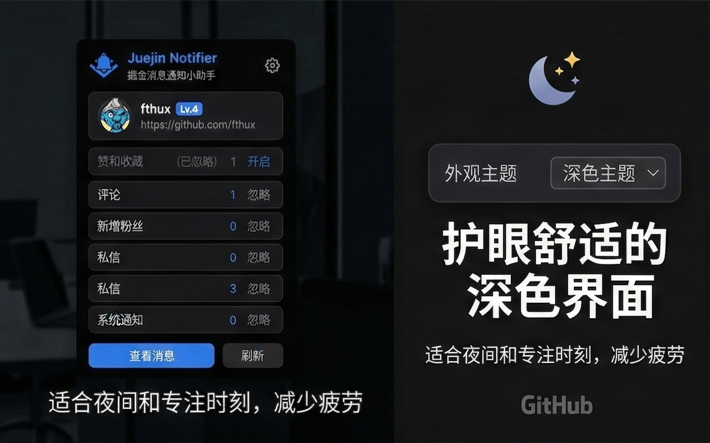
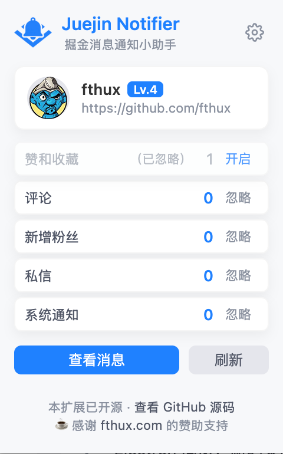
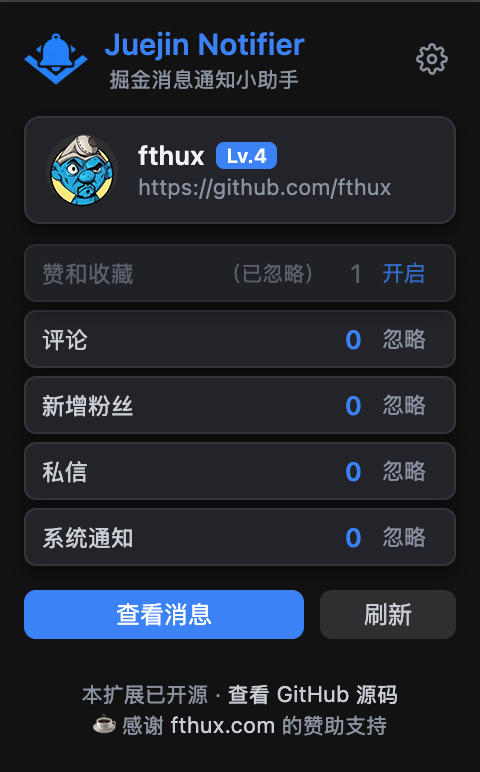
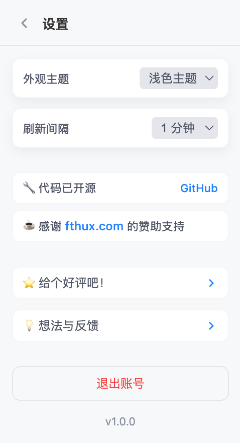
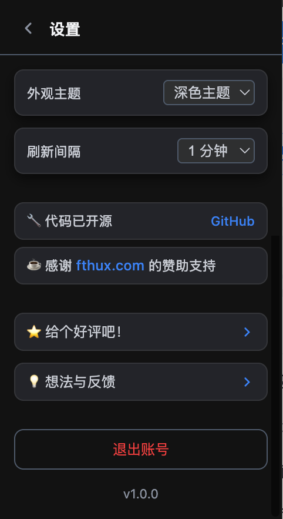
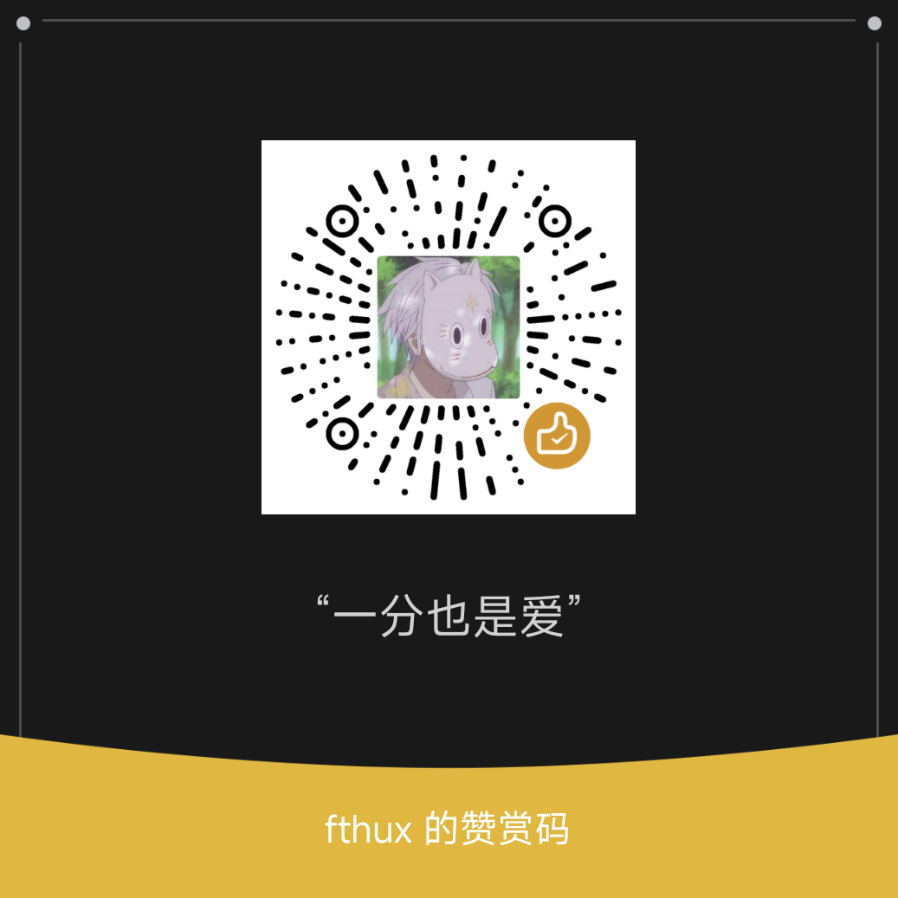

# Juejin Notifier

方便及时的获取掘金（[juejin.cn](juejin.cn)）消息通知。

  

## 📖 简介

`Juejin Notifier` 是专门为掘友设计的一款 `Chrome` 扩展工具，通过掘金的官方 `API` 获取消息通知，并及时的通知您。无需频繁打开掘金网页，即可第一时间获知您的赞和收藏、评论、新增粉丝、私信等动态。

> ⚠️ 提示：`Juejin Notifier` 使用的是掘金的官方 `API`，但并不是掘金的官方产品。您的所有信息都只存储在您的电脑中，`Juejin Notifier` 不会上传任何信息，请您放心食用。

## ✨ 特点

- 🔔 实时通知：及时获取新消息，不错过任何互动。

- 👀 大道至简，快速预览：快速查看各类消息通知条数。

- 🎨 个性化设置：

  - 可忽略不关心的消息类型。

  - 自定义刷新时间间隔。

- 多主题支持（跟随系统 / 浅色 / 深色）。

- 🔄 手动/自动刷新：支持手动刷新消息，也可设置自动刷新间隔。

## 🖼️ 宣传图

## 🖼️ 截图预览

## 📦 安装方法

### 方式一：Chrome 网上应用店安装（推荐）

访问 `Chrome` 网上应用店中的 `Juejin Notifier` 页面。

点击“添加到 `Chrome`”即可完成安装。

### 方式二：本地安装（开发者模式）

克隆项目，打开 `Chrome` 浏览器，进入扩展管理页面 (`chrome://extensions/`)，开启右上角的“开发者模式”，点击“加载已解压的扩展程序”，选择扩展文件夹即可。

## 🚀 如何使用

安装扩展：按照上述任一方法完成安装。

登录掘金：点击浏览器右上角的扩展图标，打开 `Juejin Notifier`。如果尚未登录，点击“前往登录”按钮，在打开的掘金官网完成登录。登录成功后，扩展会自动获取您的登录信息。

等待通知：扩展会自动开始监测新消息，并在有新消息时通过角标和弹窗提醒您。

## 💡 小技巧

- 屏蔽不关心的消息：如果您不想收到某类消息的通知（例如系统通知），可以在扩展中点击对应消息后面的“忽略”按钮。

- 调整刷新频率：点击底部的“刷新间隔”下拉菜单，可以调整自动刷新的时间间隔（如 1 分钟、5 分钟等）。

- 手动刷新：随时点击“刷新”按钮，立即获取最新消息。

- 切换主题：默认情况下，扩展主题会跟随您的系统设置。您也可以在扩展底部的“外观主题”处手动切换为“浅色主题”或“深色主题”。

- 退出账号：点击“退出账号”，在弹出的确认框中点击“确定退出”即可清除本地登录信息。

## 本地调试

按照“本地安装”方式加载扩展。修改代码后，在 `chrome://extensions/` 中找到扩展，点击“重新加载”即可生效。

## Buy me a coffee

### 微信赞赏码

### 爱发电

[爱发电](https://ifdian.net/a/fthux)

### Bitcoin

 `3NvpQfHYZtLUtRajGbPdNFnK8in3vyvNqx`

### Ethereum

 `0x889408D0A04a1ef32c914A6398f955b83f3554a2`

## 📄 许可证

[MIT](http://opensource.org/licenses/MIT)

## 🙏 致谢
感谢 [掘金](juejin.cn) 提供的 `API` 接口。

